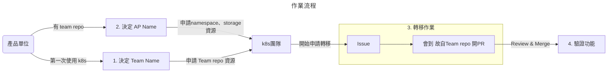

# k8s-linux-ap
* 專門給本司的 Linux AP 轉移到 K8s 上的專案
## 步驟：
* 請先向你所屬開發團隊確認：貴團隊是否過去已經建立過給 K8s 部署的 GitOps Repositry 了？

ℹ️ 如果貴團隊尚未建立過 Team Repository，請先依照「[製作 GitOps Repository](https://hackmd.io/@104ContainerizationProject/BJFFt1_hK/%2F4et2hUSjRD-sxixTI-_gGQ)」的說明，建立貴團隊的 Team Repository 並申請註冊到叢集。並通知維運人員:Deep.Huang

### 1. 決定 AP Name

* 過去 AP 都是使用 AP 取號方式取得一個號碼 <ex:2949>，故名稱將作為: AP-2949，請建置 AP Name:AP-2949 的 Namespace

### 2. 進行轉移

📄 請點[此連結](https://github.com/104corp/k8s-linux-ap/issues/new?assignees=&labels=team%2Cmigrate-ap&projects=&template=migrate-team-linux-ap.yaml&title=%E7%94%B3%E8%AB%8B%E9%81%B7%E7%A7%BB+%5BAPP_NAME%5D+%E6%8E%92%E7%A8%8B%E7%A8%8B%E5%BC%8F%E5%88%B0+k8s+)建立 GitHub issue。
* 請到repo確認是否有相關的檔案，如果沒有請自行建立